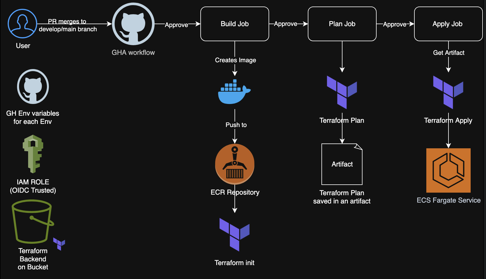

# Condé-Nast-Cloudplatform-Challenge


This repository contains a sample application deployed to **AWS ECS Fargate** using **GitHub Actions**, **AWS ECR**, and **Application Load Balancer (ALB)**.  
It demonstrates a full CI/CD flow where each push builds a Docker image, tags it using the component version, pushes it to ECR, and deploys it to ECS.

---

## 🟠 Overview

This project deploys a simple "Hello World" service running on **AWS ECS Fargate**.  
The deployment is triggered through GitHub Actions and includes:

- Docker image build
- IaC approach with Terraform
- Version tagging using the current component Version
- Push to AWS ECR
- ECS Deployment using a Task Definition and Service
- Exposure to the public through an Application Load Balancer (ALB)

---

##  Diagram



---

## 📐 Architecture Components

This project uses the following AWS components:

### **1. Amazon ECR**
- Hosts the Docker images
- The image is tagged using the value inside `VERSION`
- One repository per environment (e.g., `hello-world-app-dev`, `hello-world-app-prod`)

### **2. Amazon ECS (Fargate)**
- Serverless container orchestration
- No EC2 instances needed
- Handles task scaling and health checks

### **3. ECS Task Definition**
- Defines CPU/memory
- Container image
- Port mappings
- Logging

### **4. ECS Service**
- Ensures the Task remains running
- Performs rolling deployments
- Connects to the Target Group used by ALB

### **5. Application Load Balancer (ALB)**
- Routes traffic from the internet to ECS
- Uses a Target Group configured for the Fargate service

### **6. Cloudwatch Monitoring**
- A log group for the service gets automatically created
- The Log Configuration on the task definition was set up
- Both resources to visualize and monitor the logs of the tasks running from the service

---

## ▶️ How to Consume the Service

Once deployed, you can access the application through the DNS Name of the ALB
e.g **hello-alb-dev-1249328235.us-west-2.elb.amazonaws.com**

If the service is running, you should see:

"Hello World and Condé Nast team!"

Also you can check the status of the balancer consuming directly the suffix /health
e.g **hello-alb-dev-1249328235.us-west-2.elb.amazonaws.com/health**

---

## 🔀 CI/CD Process Summary

1. Push code → GitHub Actions triggers the pipeline
2. Pipeline reads the `VERSION` file
3. Builds the Docker image under `app/`
4. Tags image using the version (e.g., `1.0.5`)
5. Pushes the tagged image to the correct ECR repository
6. Uploads an artifact with the version tag
7. The Deploy job (separate workflow) uses the artifact to update the ECS Service

---

## 📋 Prerequisites

### **🔑 1. GitHub Actions variables/secrets**
You must configure these:

| Variable | Description |
|---------|-------------|
| `AWS_ACCOUNT` | AWS Account ID |
| `ENV` | Environment name (`dev`, `prod`, etc.) |
| `COMPONENT` | Component name (e.g., `cn-webpage`) |


## 🆔 2. IAM Role for GitHub Actions

GitHub requires an OIDC trust relationship role. Example:

**Role:** `gh-actions-role`  
**Policies:**
- `AmazonEC2ContainerRegistryFullAccess`
- `AmazonECS_FullAccess`

Trust policy must allow GitHub OIDC provider.


## 🐳 3. AWS ECR Repository

You must manually create the ECR repository for each environment:

Example:

- `hello-world-app-dev`
- `hello-world-app-prod`

These must match the names referenced in the workflow:
```md
ECR_REPO=hello-world-app-${{ vars.ENV }}
```


## 🪣 4. Bucket and DynamoDB table for the backend

This project uses a remote backend to securely manage Terraform state across environments.  
The **Terraform state files (`tfstate`) are stored in an S3 bucket**, ensuring durability, versioning, and centralized visibility of infrastructure changes.  

To prevent concurrent modifications, **a DynamoDB table is used to store state locks**, guaranteeing that only one Terraform operation can run at a time.  
This combination of S3 + DynamoDB provides a reliable, production-grade backend for Infrastructure as Code workflows.

---

## 🔄 Versioning Strategy

The Docker tag is **not** the commit hash.  
Instead, it uses the content of the repository file:
Example: 
```md
1.0.8
```

When you bump this value and push a commit, a new image is built and deployed automatically.

---

## ✅ Deployment Workflow Summary

### Build Job
- Reads version from `VERSION`
- Builds Docker image under `app/`
- Tags it as `<version>`
- Pushes it to ECR
- Saves image tag artifact

### Plan Job
- Downloads the artifact
- Creates a plan for the changes to be deployed or changed in the component
- Saves the  plan in an artifact as tfplan

### Apply Job
- Downloads the tfplan artifact
- Updates ECS task definition
- Forces ECS Service deployment
- Waits for "steady state"

---

## 🏆 Final Result

When everything is configured:

- Every push builds and publishes a new versioned Docker image
- The main branch is configured to execute all this steps whenever you push to it
- In order to push to the main branch, you must create a PR and get 2 approves
- Once the workflow is activated and the pipeline runs, it waits for a manual approval on every job of the pipeline in order to see the changes that will be implemented before actually deploying them
- Once the pipeline finishes, ECS automatically deploys the image
- Load Balancer publicly exposes the app
- The app can be consumed through the ALB’s DNS

This setup provides a clean, scalable, production-ready CI/CD pipeline for ECS Fargate using GitHub Actions.

---